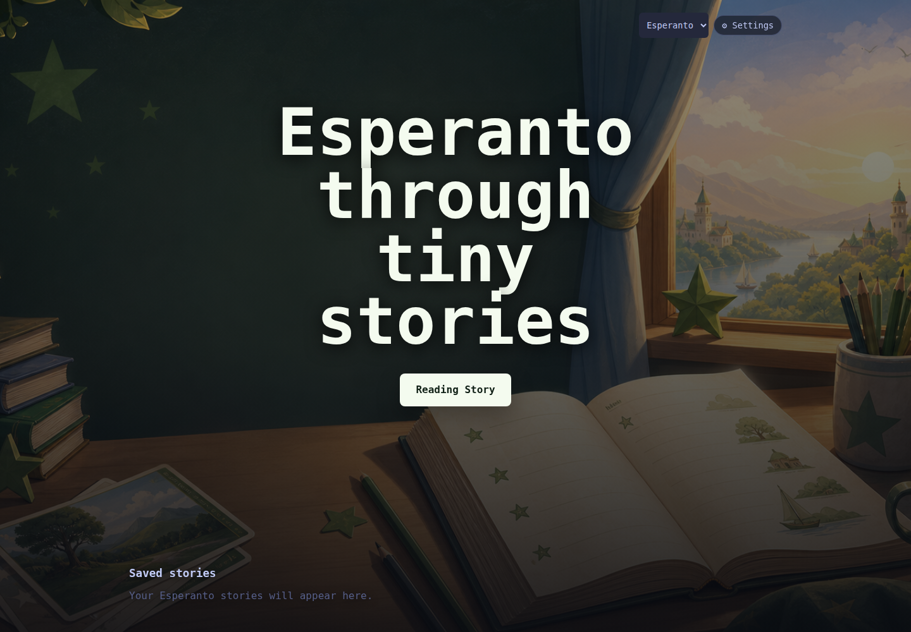
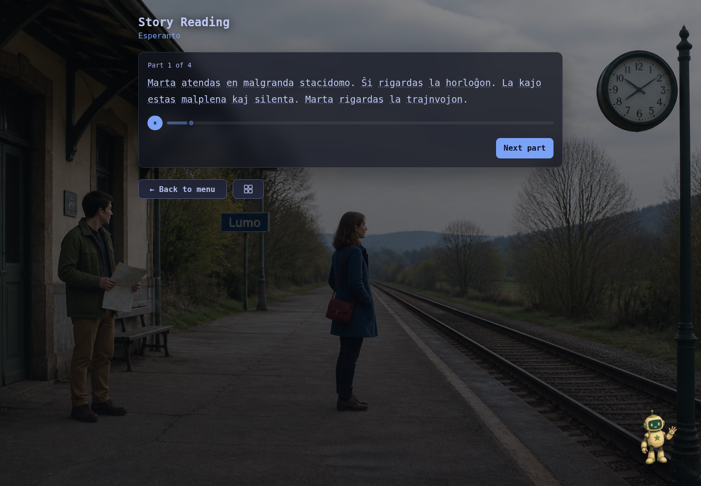
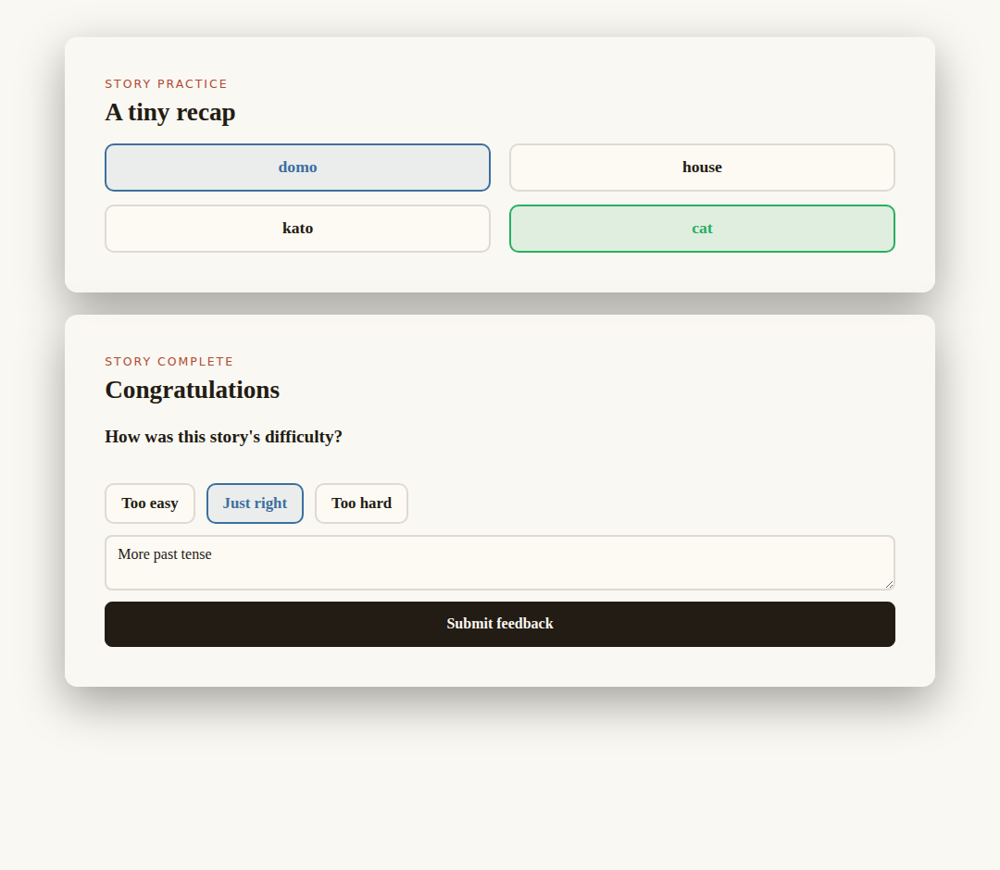

# Language stories

An AI reading-practice app for Esperanto, German, Spanish, Dutch, and Finnish. Choose the
learning language on the main menu, read a finite illustrated and narrated
story, tap unfamiliar words, and finish with a short recap.

The goal is an adaptive reading loop: each story gives the learner useful
evidence, and the next story uses that evidence to meet the learner where they
are. The app is designed to adjust language focus and difficulty over time,
while keeping the reading experience small, concrete, and story-shaped.

The interface is currently English. Language selection is window-specific via
`?language=esperanto|german|spanish|dutch|finnish`, while the most recently selected
language is remembered locally for the next unqualified home visit. Explicit
`prefer` and `avoid` story settings are shared; stories, preparation queues,
evidence, pronunciation caches, and progression remain language-specific.

## The learner experience



From the menu, the learner chooses a language and starts or resumes a reading
story. One complete story is prepared before reading begins, so the learner can
move through it at their own pace.



Stories are revealed in short sections. Each section can be narrated and
illustrated; tapping a word opens contextual English help and pronunciation.
The language tutor bot can answer questions about the story, vocabulary, and
grammar while the learner is reading.



After reading, a short recap checks words and the story's language focus. The
learner can also say whether the difficulty was too easy, about right, or too
hard, describe what to practise, and request a theme. The next-story handoff
combines that feedback with recap results, word lookups, and tutor questions to
reinforce or advance the next language focus and adjust its complexity.

## How the AI system is organized

This is a modular AI app rather than one large generation call. Separate
capabilities handle story planning and prose, section narration, illustrations,
word glosses and pronunciation, tutor chat, recap exercises, and the next-story
handoff. The browser talks to the server, and the server selects the configured
provider for each capability. Generated stories and media are cached locally
where possible.

OpenAI is required for the default local setup. `GEMINI_API_KEY` is optional
and enables Gemini text models, higher-quality Gemini narration, and Gemini
single-word pronunciation. `ANTHROPIC_API_KEY` is optional and is currently
used for Claude-model experimentation. The settings menu disables models whose
provider key is not configured.

Language identity and generation guidance live in the registry at
[`src/languages.ts`](./src/languages.ts). Adding another language is primarily a
registry-and-assets change. Shared code derives generic prompts, speech
instructions, starter defaults, and asset paths. Follow the coding-agent
workflow in [`docs/adding-a-language.md`](./docs/adding-a-language.md).

## Development

```bash
npm install
echo 'OPENAI_API_KEY=sk-...' > .env.local
npm run dev
npm run check
```

The development server runs the API on port 3001 and Vite on its normal port.
Provider keys stay server-side. `GEMINI_API_KEY` is optional: it enables Gemini text models, Gemini narration,
and Gemini single-word pronunciation. Without it, narration and pronunciation
use OpenAI TTS instead. The settings menu disables models whose provider key is
not configured. `ANTHROPIC_API_KEY` remains optional and is only needed for
Claude models.

| Command | Purpose |
| --- | --- |
| `npm run dev` | Run API and browser app. |
| `npm run build` | Type-check and build client and server. |
| `npm run check` | Run build, lint, and all deterministic tests. |
| `npm run language:validate -- finnish` | Validate Finnish registry fields, assets, and storage IDs. |
| `npm run story:generate -- --language dutch` | Generate one complete story through the real provider pipeline. |
| `npm run story:chain` | Simulate a sequence of stories and handoffs. |
| `npm run verify:page -- <url>` | Render a page in a real browser and fail on runtime errors. |

Provider-backed scripts can cost money and are not part of `npm run check`.
Local saves and generated media are plain files grouped under
`stories/<language>/`; see
[`docs/local-data.md`](./docs/local-data.md). AI call ownership and caching are
described in [`docs/ai-workflows.md`](./docs/ai-workflows.md).

### Adding a language with Codex

Language additions are designed as a coding-agent workflow. Ask Codex to follow
the repository's language-addition guide: it extends
[`src/languages.ts`](./src/languages.ts) with the language's identity and
learning guidance, adds the story poster, bot, and favicon under `public/`,
and validates the result in the local checkout:

```bash
npm run language:validate -- <language-id>
npm run check
```

The registry derives shared prompts, speech instructions, starter defaults, and
asset paths; the workflow should not create a parallel application or
language-specific fork. See
[`docs/adding-a-language.md`](./docs/adding-a-language.md) for the required
fields, asset conventions, and validation checklist.
